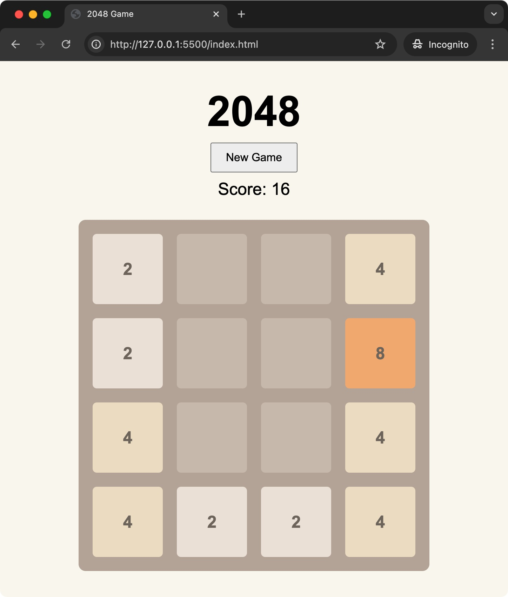

# 2048 Game

This is a simple implementation of the popular 2048 game. The objective of the game is to slide numbered tiles on a grid to combine them and create a tile with the number 2048.

## How to Play

- Use the arrow keys on your keyboard to move the tiles.
- When two tiles with the same number touch, they merge into one.
- The game is over when there are no empty spaces and no possible merges left.

## Features

- New Game button to start a new game.
- Score display to keep track of your current score.
- Game over message when no more moves are possible.

## Files

- `index.html`: The main HTML file that sets up the structure of the game.
- `style.css`: The CSS file that styles the game.
- `script.js`: The JavaScript file that contains the game logic.

## Setup

To play the game, simply open the `index.html` file in your web browser.

## License

This project is licensed under the MIT License.